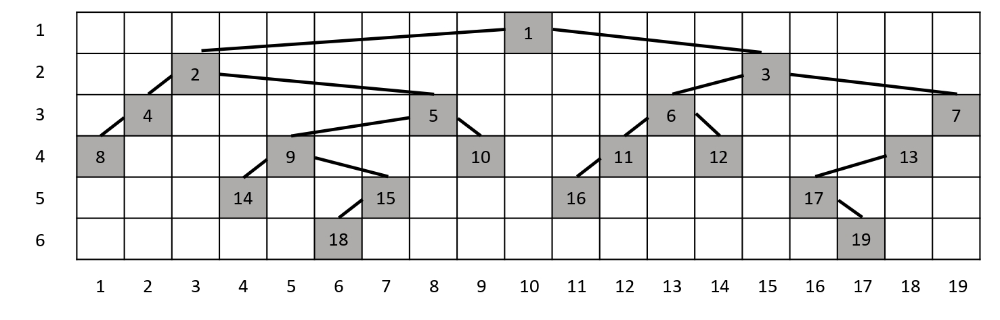

# Problem 2
You want to draw a binary tree in a grid-like frame with rows and columns numbered according to the following rules. You want to draw it according to the following rules

Nodes at the same level in the binary tree are located in the same row.

+ There is only one node in a column.
+ Nodes in the left subtree of any node are placed in the column to the left of that node, and nodes in the right subtree are placed in the column to the right of that node.
+ There is no empty column between the leftmost and rightmost columns with no nodes.
+ When drawing a binary tree according to these rules, the width of each level is the largest of the column number differences between neighboring nodes at each level plus one. The root node is considered to have a width of 1.

The figure below depicts a binary tree using the above rules. The width of the 1-level is 1, the width of the 2-level is 13, the width of the 3-level is 7, the width of 4-level is 5, the width of the 5-level is 6, and the width of the 6-level is 12.



We want to calculate the widest level and the width of that level when the given binary tree is drawn according to the above rules. In the example illustrated above, the widest level is 2, with a width of 13. If there is more than one level with the widest width, the answer is the level with the smaller number.

Given an arbitrary binary tree as input, write a program that outputs the widest level and the width of that level.

## Input & Output Format

The first line is an integer $N$ ($1 \le N \le 10,000$) representing the number of nodes. The next $N$ lines contain the number of the node and the numbers of its left and right children, in order, on each line. The nodes are numbered from $1$ to $N$. If a node has no children, the number of its children is $-1$.

### Example of Input

```
19
1 2 3
2 4 5
3 6 7
4 8 -1
5 9 10
6 11 12
7 13 -1
8 -1 -1
9 14 15
10 -1 -1
11 16 -1
12 -1 -1
13 17 -1
14 -1 -1
15 18 -1
16 -1 -1
17 -1 19
18 -1 -1
19 -1 -1
```

### Example of Output

```
2 13
```
