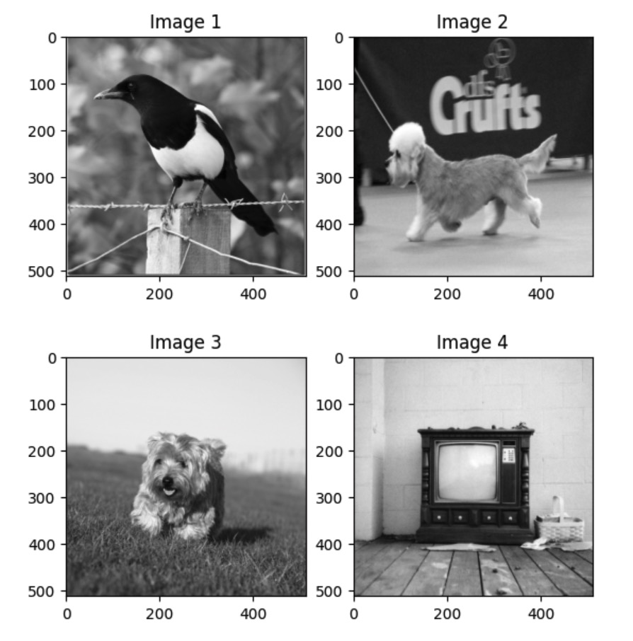
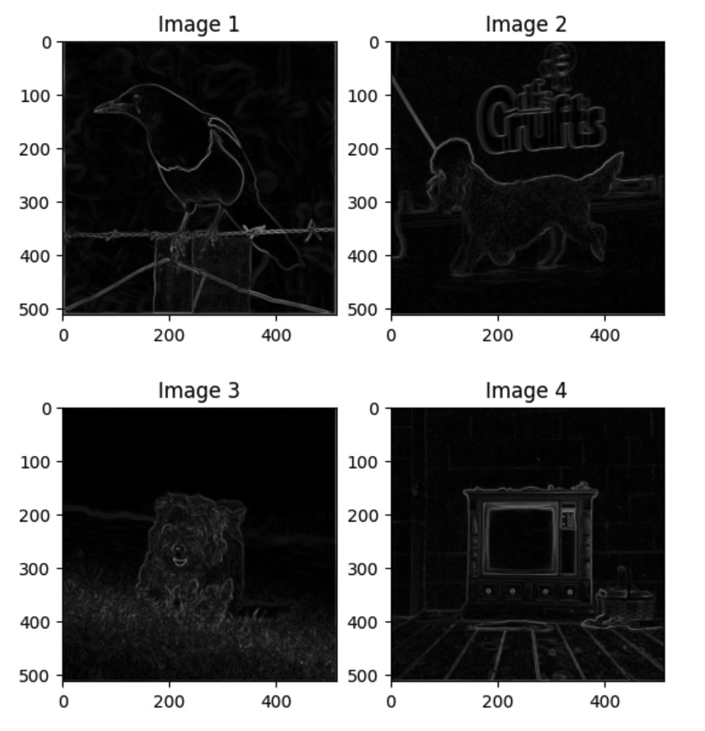

# Problem 4
### Assignment: Implementation of Convolution Operation and Edge Detection using Sobel Filter 
## Introduction
The Sobel filter is one of the commonly used edge detection filters in image processing. This filter is effective in detecting intensity changes at the edges of an image and is primarily used for edge detection. In this assignment, the goal is to directly implement the convolution operation for the Sobel filter to perform image edge detection.
## Working Principle of the Sobel Filter
The Sobel filter calculates vertical and horizontal edges for each pixel. This allows us to estimate the edge strength for each pixel. The vertical Sobel filter is primarily used for detecting edges in the column direction, while the horizontal Sobel filter is used for detecting edges in the row direction.  
# 

## Assignment Objectives
- Implement Convolution operation  using only NumPy in Python
* Apply the Sobel filter using a directly implemented Convolution operation to detect edges in a given image and visualize the edge intensity.

## Instructions
* **Implementation of Convolution Operation**
Write a function called **apply_convolution(image, kernel,  stride, padding)**. This function should perform Convolution by applying the given kernel to the input image and return the result.

* **Edge detection using Sobel Filter**
  * Apply the Convolution operation with the directly implemented Sobel filter to various images and visualize the edges.
  * Experiment with changing the filter size, stride, and padding values, and discuss how these changes affect edge detection.
  * If necessary, use libraries such as OpenCV, Matplotlib for image processing, and visualization.

## Submission
* **main.py** : A source code file containing the implementation of the Convolution operation.
* **Result Images**: Image files for visualizing the original image, Sobel filter Convolution results, etc.

## Examples
- Original images

- Result images
###  

